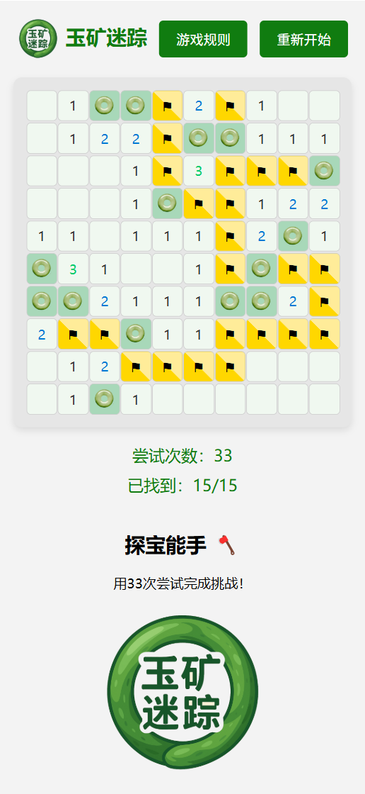
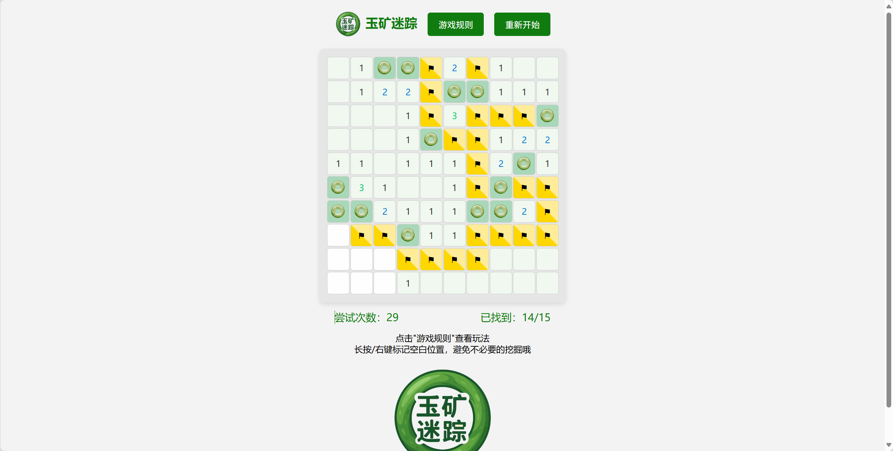
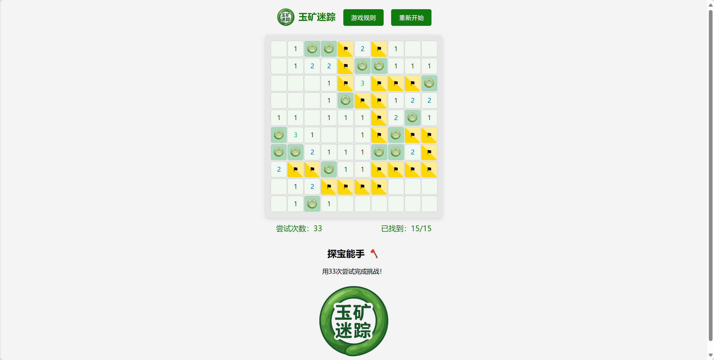
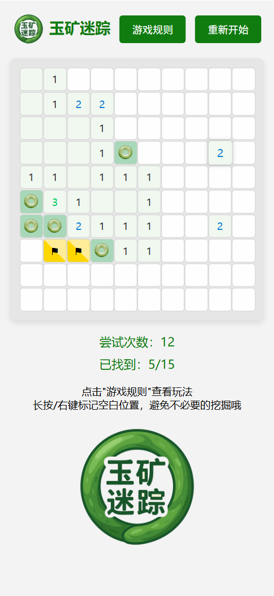

# 玉矿迷踪 - 寻宝大冒险

## 游戏简介
玉矿迷踪是一款基于经典扫雷玩法改编的寻宝游戏，玩家需要在10x10的矿区中寻找全部15块隐藏玉石。游戏支持PC和移动端双端适配。

## 我要游玩

[点击此处开始游戏](boatchanting.github.io/findjade/)

## 核心特色
✨ **玉石主题创新**  
- 采用玉石挖掘主题，包含专属玉石图标（yu.png）和游戏logo（logo.png）
- 原创段位系统（宗师/专家/能手/新手）

🎮 **游戏机制**  
- 左键/短按挖掘，右键/长按标记
- 空白区域自动展开
- 实时统计尝试次数和发现进度

📱 **多端适配**  
- 响应式布局自动适配手机屏幕
- 优化触摸操作体验

## 游戏规则
| 操作方式 | 说明 |
|---------|------|
| PC端 | 左键挖掘 / 右键标记 |
| 移动端 | 短按挖掘 / 长按标记 |

💎 **胜负机制**  
- 胜利：找到全部15块玉石
- 失败：挖到空矿（会显示所有玉石位置）

🏆 **段位系统**  
| 尝试次数 | 段位称号 |
|---------|----------|
| ≤20次 | 寻玉宗师 🎓 |
| 21-30次 | 采矿专家 🔨 |
| 31-40次 | 探宝能手 🪓 |
| ＞40次 | 新手矿工 🧒 |

## 游玩示例

